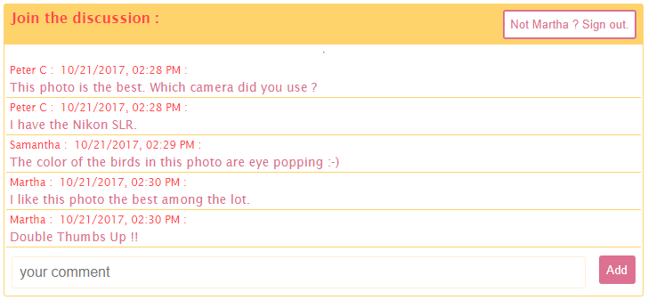

##  comment-on-it

**comment-on-it** is the answer to every Site developer's need to add 'Comments' functionality without breaking a sweat. It is a ReactJs, **Webtask**-based Serverless component that can be used as a regular ReactJs component anywhere that Comments are needed on a site.


<br />

See it in action here, used in a Photo-based static website:

https://photo-comments.herokuapp.com/

*Note: The site may be asleep, patience !*

---
### Achitecture:

*   **comment-on-it** is implemented as a Serverless Component.
*   The User interface is implemented using [ReactJs](https://reactjs.org/).
*   It uses a [Webtask](https://webtask.io/) to manage its backend functionality.
*   [mLab](https://mlab.com/) is a cloud based MongoDB provider, that is used to store the comments from the site.

### Usage

*   ```npm install --save comment-on-it```  *[see it on npmjs](https://www.npmjs.com/package/comment-on-it)*
*   Use it in your component.
```
import { CommentOnIt } from 'comment-on-it'
:
:

    render() {
        return (
            <div>
                
                <CommentOnIt
                    appId='52063950-79bc-4b59-b2a7-f7b4cd2430ca'
                    instanceId='Photo1'
                    header='Join the discussion :' />
            </div>
        );
    };

```
*   The component takes 3 props:
    *   ```appId```: This is unique to your site. Get an AppId by registering your credentials here ```<TDB>```. *For now, use your site url as an unique identifier.*
    *  ```instanceId```: This refers to the context of the Comments. In the example above, the comments are related to 'Photo1'.
    *  ```header```: This shows up as the HeaderText on the Comment component.
*   When the component is loaded, it gets the Comments posted for this AppId and InstanceId combination.
*   If any of the props change, the Comments are queried again and refreshed
*   The component remembers the logged in user, and attaches the username to every comment posted.
*   The user can logout to clear the username.

---

### Sneak Preview of Version 2.0.0 *(Release date not confirmed yet.)*
*   Custom Themes to match your website theme.
*   Integration with [Auth0 Lock](https://auth0.com/lock) screen to enable easy and secure SignIn / SignUp.
*   Discussion threads (user replies to other comments).
*   Comment mediation by site admin.
